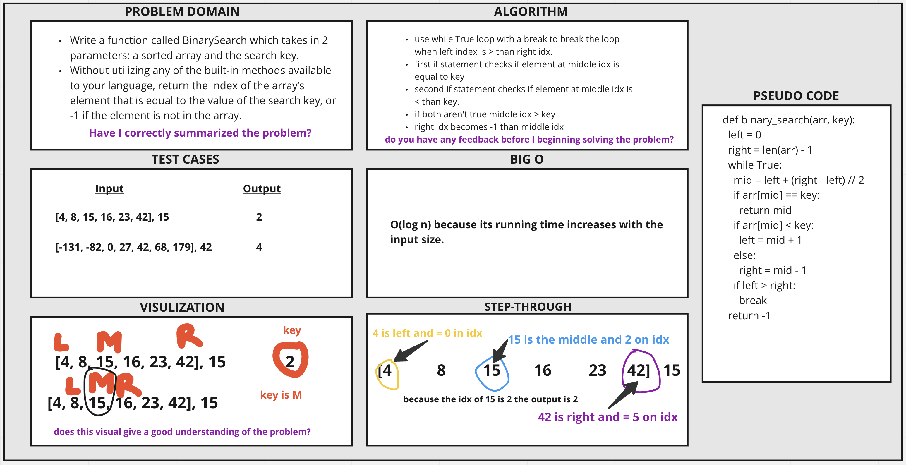

# Array Binary Search
<!-- Description of the challenge -->
Write a function called BinarySearch which takes in 2 parameters: a sorted array and the search key.

Without utilizing any of the built-in methods available to your language, return the index of the array’s element that is equal to the value of the search key, or -1 if the element is not in the array.

## Whiteboard Process
<!-- Embedded whiteboard image -->

## Approach & Efficiency
<!-- What approach did you take? Discuss Why. What is the Big O space/time for this approach? -->

This honestly took an extremely long time for me to figure out. I had to do a lot of googling of array binary search. I'm still not used to python's syntax as opposed to javascript.

Use while True loop with a break to break the loop when left index is > than right idx.

First if statement checks if element at middle idx is equal to key.

Second if statement checks if element at middle idx is < than key.

If both aren't true middle idx > key.

Right idx becomes -1 than middle idx.
