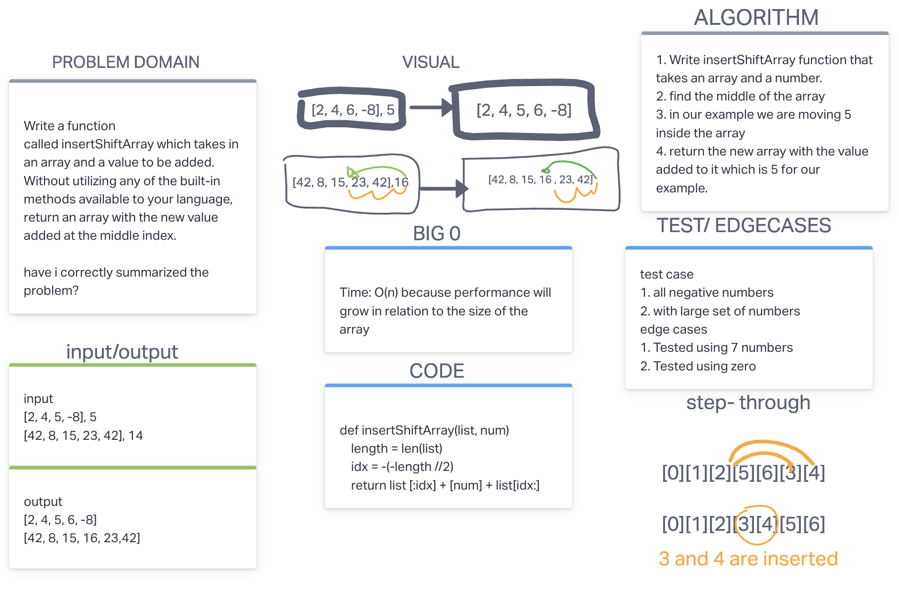

# Insert to Middle of an Array
<!-- Description of the challenge -->
Write a function called insertShiftArray which takes in an array and a value to be added. Without utilizing any of the built-in methods available to your language, return an array with the new value added at the middle index.

## Whiteboard Process
<!-- Embedded whiteboard image -->

## Approach & Efficiency
<!-- What approach did you take? Discuss Why. What is the Big O space/time for this approach? -->

I wasn't completely sure how to solve this code challenge originally so I went on to google and searched it a bit more.

1. Write insertShiftArray function that takes an array and a number.

2. Find the middle of the array

3. In our example we are moving 5 inside the array

4. Return the new array with the value added to it which is 5 for our example.

## Big O Notation

Time: O(n) because performance will grow in relation to the size of the array.
