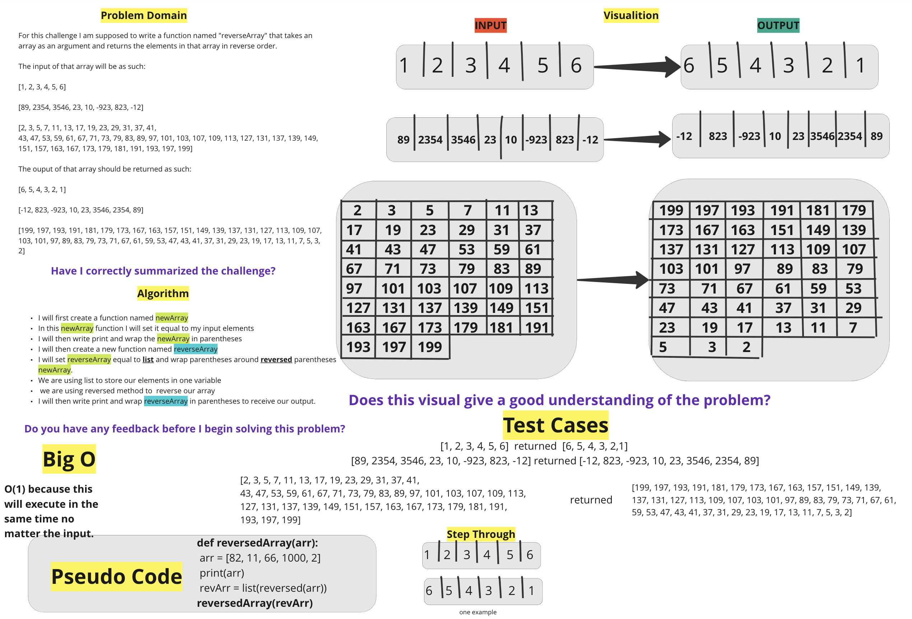

# Reverse an Array
<!-- Description of the challenge -->
For this challenge I am supposed to write a function named "reverseArray" that takes an array as an argument and returns the elements in that array in reverse order.

The input of that array will be as such:

[1, 2, 3, 4, 5, 6]

[89, 2354, 3546, 23, 10, -923, 823, -12]

[2, 3, 5, 7, 11, 13, 17, 19, 23, 29, 31, 37, 41,
43, 47, 53, 59, 61, 67, 71, 73, 79, 83, 89, 97, 101, 103, 107, 109, 113, 127, 131, 137, 139, 149, 151, 157, 163, 167, 173, 179, 181, 191, 193, 197, 199]

The ouput of that array should be returned as such:

[6, 5, 4, 3, 2, 1]

[-12, 823, -923, 10, 23, 3546, 2354, 89]

[199, 197, 193, 191, 181, 179, 173, 167, 163, 157, 151, 149, 139, 137, 131, 127, 113, 109, 107, 103, 101, 97, 89, 83, 79, 73, 71, 67, 61, 59, 53, 47, 43, 41, 37, 31, 29, 23, 19, 17, 13, 11, 7, 5, 3, 2]

## Whiteboard Process
<!-- Embedded whiteboard image -->

## Approach & Efficiency
<!-- What approach did you take? Discuss Why. What is the Big O space/time for this approach? -->

I first created a function named newArray
In this newArray function I will set it equal to my input elements
I will then write print and wrap the newArray in parentheses
I will then create a new function named reverseArrav
I will set reverseArray equal to list and wrap parentheses around reversed parentheses newArray.
We are using list to store our elements in one variable we are using reversed method to reverse our array
I will then write print and wrap reverseArray in parentheses to receive our output.

## Big O notation:

O(1) because this will execute in the same time no matter the input.
