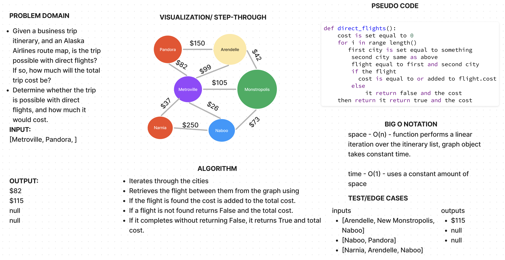

# Graph Business Trip

[Graph Business Trip Challenge](https://github.com/deshondixon/data-structures-and-algorithms/blob/main/python/code_challenges/graph_business_trip.py)

## Challenge
<!-- Description of the challenge -->

- Given a business trip itinerary, and an Alaska Airlines route map, is the trip possible with direct flights? If so, how much will the total trip cost be?
- Determine whether the trip is possible with direct flights, and how much it would cost.

## Whiteboard Process
<!-- Embedded whiteboard image -->

## Approach & Efficiency
<!-- What approach did you take? Why? What is the Big O space/time for this approach? -->

Big O Notation:

- time - O(1) - uses a constant amount of space
- space - O(n) - function performs a linear iteration over the itinerary list, graph object takes constant time.

## API
<!-- Description of each method publicly available to your Stack and Queue-->

- Write a function called business trip
- Arguments: graph, array of city names
- Return: the cost of the trip (if it’s possible) or null (if not)

## Tests

[Graph Business Trip Unit Tests](https://github.com/deshondixon/data-structures-and-algorithms/blob/main/python/tests/code_challenges/test_graph_business_trip.py)

## References

- Referenced example given on page from Code Challenge: Class 37.
- Referenced https://www.youtube.com/watch?v=j0IYCyBdzfA
