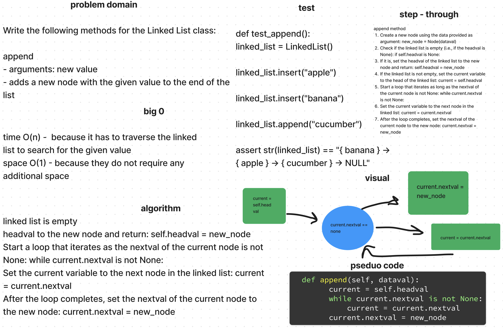

# Linked List Insertions

[Linked List Code Challenge](https://github.com/deshondixon/data-structures-and-algorithms/blob/main/python/data_structures/linked_list.py)

<!-- Description of the challenge -->

Write the following methods for the Linked List class:

### append
- arguments: new value
- adds a new node with the given value to the end of the list

### insert before
- arguments: value, new value
- adds a new node with the given new value immediately before the first node that has the value specified

### insert after
- arguments: value, new value
- adds a new node with the given new value immediately after the first node that has the value specified

## Whiteboard Process
<!-- Embedded whiteboard image -->

## Approach & Efficiency
<!-- What approach did you take? Discuss Why. What is the Big O space/time for this approach? -->

Check if the linked list is empty (i.e., if the headval is None): if self.headval is None. If it is, set the headval of the linked list to the new node and return: self.headval = new_node. If the linked list is not empty, set the current variable to the head of the linked list: current = self.headval. Start a loop that iterates as long as the nextval of the current node is not None: while current.nextval is not None. Set the current variable to the next node in the linked list: current = current.nextval. After the loop completes, set the nextval of the current node to the new node: current.nextval = new_node.
Got help understanding the visual whiteboard from classmate Jason Christopher.

### Big Notation

- time O(n) -  because it has to traverse the linked list to search for the given value
- space O(1) - because they do not require any additional space

## API

Append: arguments: new value, adds a new node with the given value to the end of the list. Insert before: arguments: value, new value, adds a new node with the given new value immediately before the first node that has the value specified. Insert after: arguments: value, new value, adds a new node with the given new value immediately after the first node that has the value specified.
## Tests

[Linked List Unit Tests](https://github.com/deshondixon/data-structures-and-algorithms/blob/main/python/tests/code_challenges/test_linked_list_insertions.py)

Wrote tests to prove the following functionality:

- Can successfully add a node to the end of the linked list.
- Can successfully add multiple nodes to the end of a linked list.
- Can successfully insert a node before a node located i the middle of a linked list.
- Can successfully insert a node before the first node of a linked list.
- Can successfully insert after a node in the middle of the linked list.
- Can successfully insert a node after the last node of the linked list.
