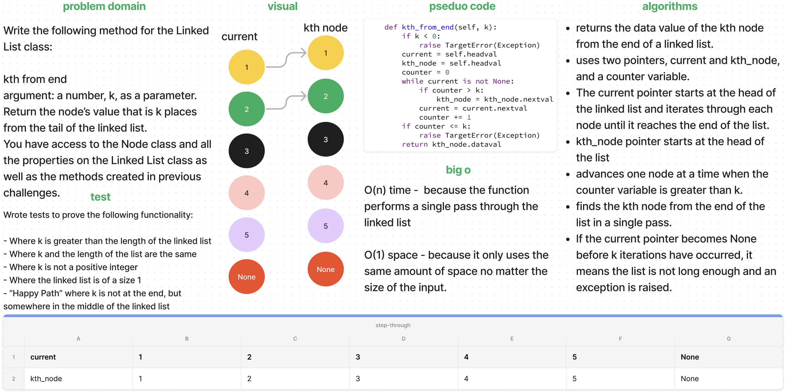

# Linked List KTH

[Linked List Code Challenge](https://github.com/deshondixon/data-structures-and-algorithms/blob/main/python/data_structures/linked_list.py)

<!-- Description of the challenge -->

Write the following method for the Linked List class:

kth from end
argument: a number, k, as a parameter.
Return the node’s value that is k places from the tail of the linked list.
You have access to the Node class and all the properties on the Linked List class as well as the methods created in previous challenges.

## Whiteboard Process
<!-- Embedded whiteboard image -->

## Approach & Efficiency
<!-- What approach did you take? Discuss Why. What is the Big O space/time for this approach? -->
Returns the data value of the kth node from the end of a linked list. Uses two pointers, current and kth_node, and a counter variable.The current pointer starts at the head of the linked list and iterates through each node until it reaches the end of the list. Kth_node pointer starts at the head of the list advances one node at a time when the counter variable is greater than k. Finds the kth node from the end of the list in a single pass. If the current pointer becomes None before k iterations happen the list is not long enough and an exception is raised.

### Big O Notation

- O(n) time -  because the function performs a single pass through the linked list

- O(1) space - because it only uses the same amount of space no matter the size of the input.

## Solution

    def kth_from_end(self, k):
        if k < 0:
            raise TargetError(Exception)
        current = self.headval
        kth_node = self.headval
        counter = 0
        while current is not None:
            if counter > k:
                kth_node = kth_node.nextval
            current = current.nextval
            counter += 1
        if counter <= k:
            raise TargetError(Exception)
        return kth_node.dataval

## Tests

[Linked List Unit Tests](https://github.com/deshondixon/data-structures-and-algorithms/blob/main/python/tests/code_challenges/test_linked_list_kth.py)

Wrote tests to prove the following functionality:

- Where k is greater than the length of the linked list
- Where k and the length of the list are the same
- Where k is not a positive integer
- Where the linked list is of a size 1
- “Happy Path” where k is not at the end, but somewhere in the middle of the linked list
