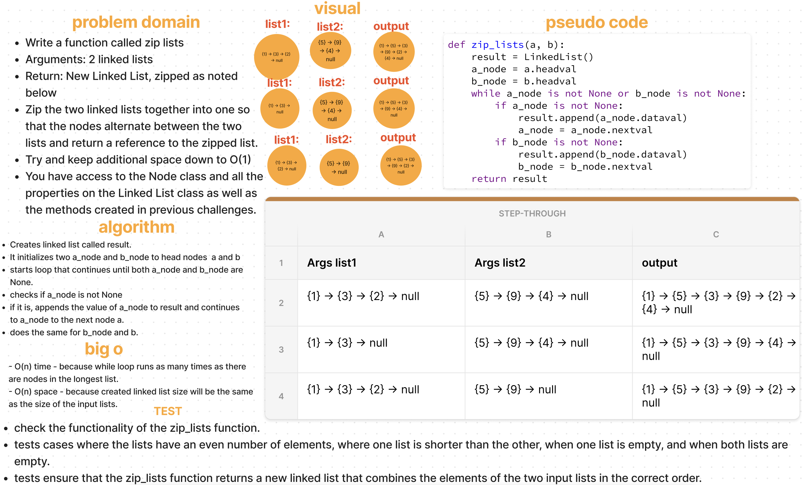

# Linked List ZIP

[Linked List ZIP Code Challenge](https://github.com/deshondixon/data-structures-and-algorithms/blob/main/python/code_challenges/linked_list_zip.py)

## Challenge
<!-- Description of the challenge -->

Write a function called zip lists

Arguments: 2 linked lists

Return: New Linked List, zipped as noted below

Zip the two linked lists together into one so that the nodes alternate between the two lists and return a reference to the zipped list.

Try and keep additional space down to O(1)

You have access to the Node class and all the properties on the Linked List class as well as the methods created in previous challenges.

## Whiteboard Process
<!-- Embedded whiteboard image -->

## Approach & Efficiency
<!-- What approach did you take? Why? What is the Big O space/time for this approach? -->

Big O Notation:

- O(n) time - because while loop runs as many times as there are nodes in the longest list.

- O(n) space - because created linked list size will be the same as the size of the input lists.
## API
<!-- Description of each method publicly available to your Stack and Queue-->

- Arguments: 2 linked lists
- Return: New Linked List, zipped as noted below

## Tests

[Linked List Unit Tests](https://github.com/deshondixon/data-structures-and-algorithms/blob/main/python/tests/code_challenges/test_linked_list_zip.py)

## Solution

    def zip_lists(a, b):
        result = LinkedList()
        a_node = a.headval
        b_node = b.headval
        while a_node is not None or b_node is not None:
            if a_node is not None:
                result.append(a_node.dataval)
                a_node = a_node.nextval
            if b_node is not None:
                result.append(b_node.dataval)
                b_node = b_node.nextval
        return result

