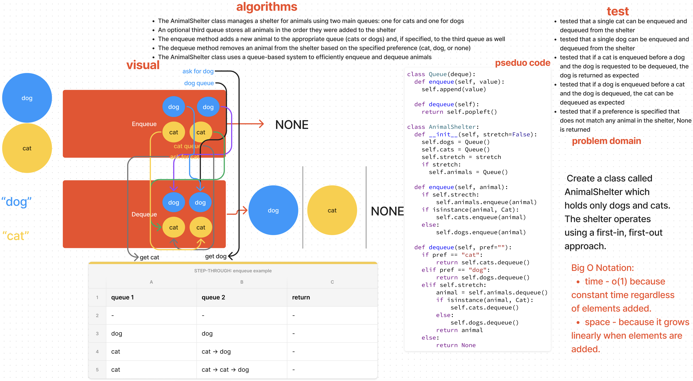

# Stacks and Queue Animal Shelter

[Stack and Queue Animal Shelter Code Challenge](https://github.com/deshondixon/data-structures-and-algorithms/blob/main/python/code_challenges/stack_queue_animal_shelter.py)

## Challenge
<!-- Description of the challenge -->

Create a class called AnimalShelter which holds only dogs and cats.
The shelter operates using a first-in, first-out approach.

## Whiteboard Process
<!-- Embedded whiteboard image -->

## Approach & Efficiency
<!-- What approach did you take? Why? What is the Big O space/time for this approach? -->

Big O Notation:

- time - o(1) because constant time regardless of elements added.
- space - because it grows linearly when elements are added.

## API
<!-- Description of each method publicly available to your Stack and Queue-->

- enqueue
    - Arguments: animal
    - animal can be either a dog or a cat object.

- dequeue
    - Arguments: pref
    - pref can be either "dog" or "cat"
    - Return: either a dog or a cat, based on preference.
    If pref is not "dog" or "cat" then return null.

## Tests

[Stack and Queue Animal Shelter Unit Tests](https://github.com/deshondixon/data-structures-and-algorithms/blob/main/python/tests/code_challenges/test_stack_queue_animal_shelter.py)

## Solution

    class Queue(deque):
      def enqueue(self, value):
        self.append(value)

      def dequeue(self):
        return self.popleft()

    class AnimalShelter:
      def __init__(self, stretch=False):
        self.dogs = Queue()
        self.cats = Queue()
        self.stretch = stretch
        if stretch:
          self.animals = Queue()

      def enqueue(self, animal):
        if self.strecth:
            self.animals.enqueue(animal)
        if isinstance(animal, Cat):
            self.cats.enqueue(animal)
        else:
            self.dogs.enqueue(animal)

      def dequeue(self, pref=""):
        if pref == "cat":
            return self.cats.dequeue()
        elif pref == "dog":
            return self.dogs.dequeue()
        elif self.stretch:
            animal = self.animals.dequeue()
            if isinstance(animal, Cat):
                self.cats.dequeue()
            else:
                self.dogs.dequeue()
            return animal
        else:
            return None

## Reference

Had trouble completing this code challenge was able to figure out from JB's reference in class. Had to make step-through short to fit in screenshot.
