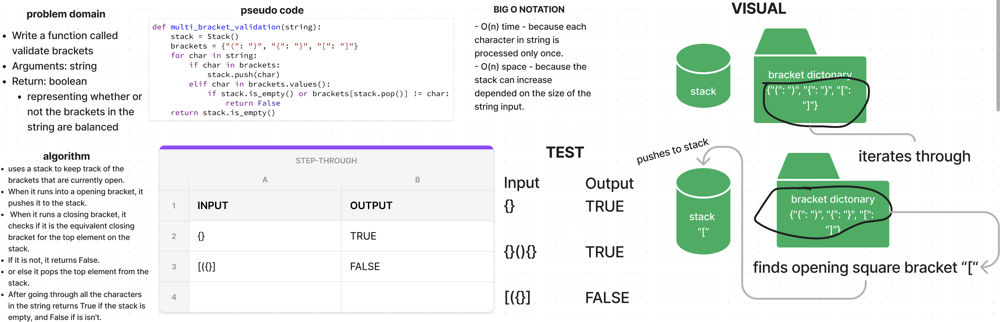

# Stacks and Queue Brackets

[Stack and Queue Brackets Code Challenge](https://github.com/deshondixon/data-structures-and-algorithms/blob/main/python/code_challenges/stack_queue_brackets.py)

## Challenge
<!-- Description of the challenge -->

Write a function called validate brackets. Arguments string. Return is boolean
representing whether the brackets in the string are balanced.

## Whiteboard Process
<!-- Embedded whiteboard image -->

## Approach & Efficiency
<!-- What approach did you take? Why? What is the Big O space/time for this approach? -->

Big O Notation:

- O(n) time - because each character in string is processed only once.
- O(n) space - because the stack can increase depended on the size of the string input.

## API
<!-- Description of each method publicly available to your Stack and Queue-->

- Arguments: string
- Return: boolean
representing whether the brackets in the string are balanced

There are 3 types of brackets:

- Round Brackets : ()
- Square Brackets : []
- Curly Brackets : {}

## Tests

[Stack and Queue Brackets Unit Tests](https://github.com/deshondixon/data-structures-and-algorithms/blob/main/python/tests/code_challenges/test_stack_queue_brackets.py)

## Solution

    def multi_bracket_validation(string):
        stack = Stack()
        brackets = {"(": ")", "{": "}", "[": "]"}
        for char in string:
            if char in brackets:
                stack.push(char)
            elif char in brackets.values():
                if stack.is_empty() or brackets[stack.pop()] != char:
                    return False
        return stack.is_empty()

