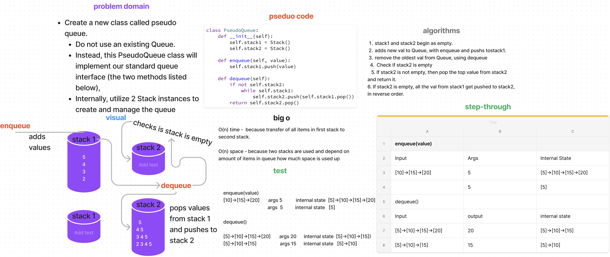

# Stacks and Queue Pseudo

[Stack and Queue Pseudo Code Challenge](https://github.com/deshondixon/data-structures-and-algorithms/blob/main/python/code_challenges/stack_queue_pseudo.py)

## Challenge
<!-- Description of the challenge -->

Create a new class called pseudo queue.
Do not use an existing Queue.
Instead, this PseudoQueue class will implement our standard queue interface (the two methods listed below),
Internally, utilize 2 Stack instances to create and manage the queue

## Whiteboard Process
<!-- Embedded whiteboard image -->

## Approach & Efficiency
<!-- What approach did you take? Why? What is the Big O space/time for this approach? -->

## API
<!-- Description of each method publicly available to your Stack and Queue-->

  - enqueue
      - Arguments: value
      - Inserts a value into the PseudoQueue, using a first-in, first-out approach.
  - dequeue
      - Arguments: none
      - Extracts a value from the PseudoQueue, using a first-in, first-out approach.

## Tests

[Stack and Queue Pseudo Unit Tests](https://github.com/deshondixon/data-structures-and-algorithms/blob/main/python/tests/data_structures/test_stack.py)

## Solution

    class PseudoQueue:
        def __init__(self):
            self.stack1 = Stack()
            self.stack2 = Stack()

    def enqueue(self, value):
        self.stack1.push(value)

    def dequeue(self):
        if not self.stack2:
            while self.stack1:
                self.stack2.push(self.stack1.pop())
        return self.stack2.pop()
