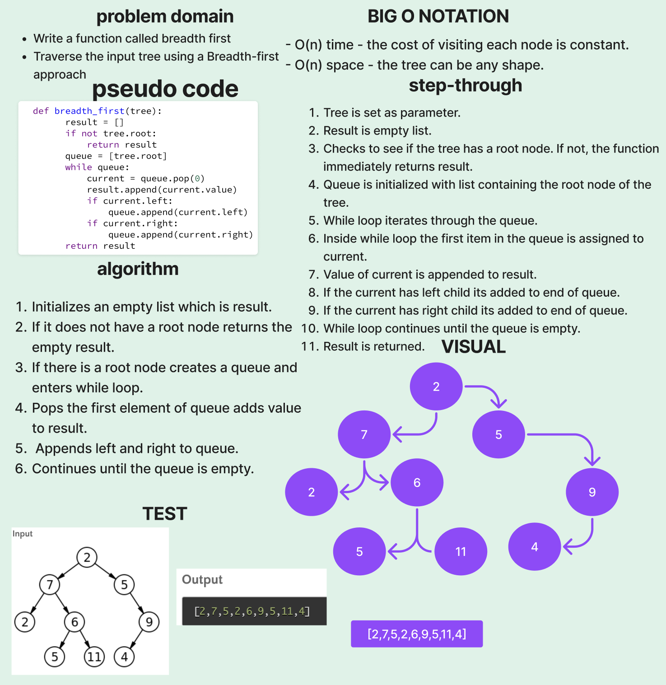

# Breadth First Traversal

[Tree Breadth Code Challenge](https://github.com/deshondixon/data-structures-and-algorithms/blob/main/python/code_challenges/tree_breadth_first.py)

## Challenge
<!-- Description of the challenge -->

- Write a function called breadth first
- Traverse the input tree using a Breadth-first approach

## Whiteboard Process
<!-- Embedded whiteboard image -->

## Approach & Efficiency
<!-- What approach did you take? Why? What is the Big O space/time for this approach? -->

Big O Notation:

- O(n) time - the cost of visiting each node is constant.
- O(n) space - the tree can be any shape.

## API
<!-- Description of each method publicly available to your Stack and Queue-->
Tree is set as parameter.
Result is empty list.
Checks to see if the tree has a root node. If not, the function immediately returns result.
Queue is initialized with list containing the root node of the tree.
While loop iterates through the queue.
Inside while loop the first item in the queue is assigned to current.
Value of current is appended to result.
If the current has left child its added to end of queue.
If the current has right child its added to end of queue.
While loop continues until the queue is empty.
Result is returned.

  - Arguments: tree
  - Return: list of all values in the tree, in the order they were encountered

## Tests

[Tree Breadth First Unit Tests](https://github.com/deshondixon/data-structures-and-algorithms/blob/main/python/tests/code_challenges/test_tree_breadth_first.py)

## Solution

    def breadth_first(tree):
        result = []
        if not tree.root:
            return result
        queue = [tree.root]
        while queue:
            current = queue.pop(0)
            result.append(current.value)
            if current.left:
                queue.append(current.left)
            if current.right:
                queue.append(current.right)
        return result
