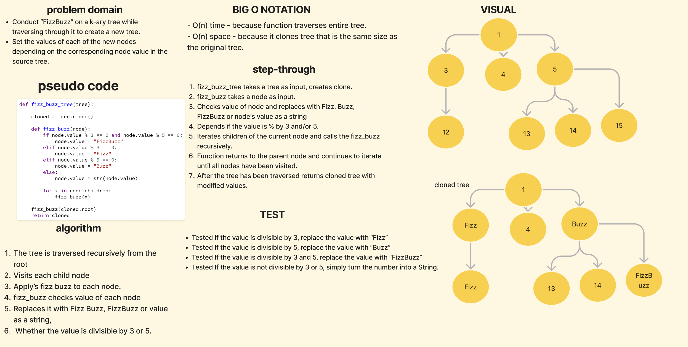

# FizzBuzz

[Fizz Buzz Code Challenge](https://github.com/deshondixon/data-structures-and-algorithms/blob/main/python/code_challenges/tree_fizz_buzz.py)

## Challenge
<!-- Description of the challenge -->

- Conduct “FizzBuzz” on a k-ary tree while traversing through it to create a new tree.

- Set the values of each of the new nodes depending on the corresponding node value in the source tree.

## Whiteboard Process
<!-- Embedded whiteboard image -->

## Approach & Efficiency
<!-- What approach did you take? Why? What is the Big O space/time for this approach? -->

Big O Notation:

- time -
- space -

## API
<!-- Description of each method publicly available to your Stack and Queue-->

- Write a function called fizz buzz tree
  - Arguments: k-ary tree
  - Return: new k-ary tree

- If the value is divisible by 3, replace the value with “Fizz”

- If the value is divisible by 5, replace the value with “Buzz”

- If the value is divisible by 3 and 5, replace the value with “FizzBuzz”

- If the value is not divisible by 3 or 5, simply turn the number into a String.

## Tests

[Fizz Buzz Unit Tests](https://github.com/deshondixon/data-structures-and-algorithms/blob/main/python/tests/code_challenges/test_tree_fizz_buzz.py)

## Solution

def fizz_buzz_tree(tree):

    cloned = tree.clone()

    def fizz_buzz(node):
        if node.value % 3 == 0 and node.value % 5 == 0:
            node.value = "FizzBuzz"
        elif node.value % 3 == 0:
            node.value = "Fizz"
        elif node.value % 5 == 0:
            node.value = "Buzz"
        else:
            node.value = str(node.value)

        for x in node.children:
            fizz_buzz(x)

    fizz_buzz(cloned.root)
    return cloned

## Reference
- Got starter code from JB for queue and to begin Kary Tree.
- Utilized code from class example Adam showed us of Ian's code to figure out this code challenge.
- Credit to Oliver Spier as well as his code was also referenced in today review of code challenge.
