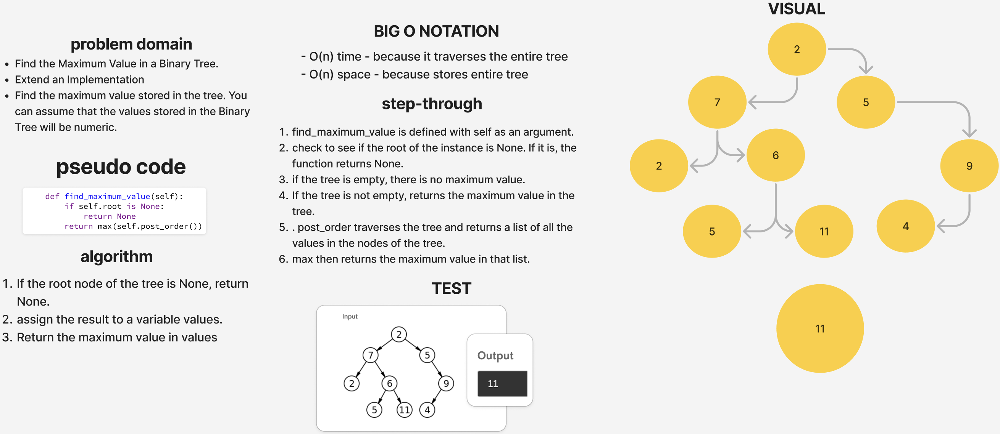

# Tree Max

[Tree Max Code Challenge](https://github.com/deshondixon/data-structures-and-algorithms/blob/main/python/data_structures/binary_tree.py)

## Challenge
<!-- Description of the challenge -->

- Find the Maximum Value in a Binary Tree.

- Extend an Implementation

- Find the maximum value stored in the tree. You can assume that the values stored in the Binary Tree will be numeric.

## Whiteboard Process
<!-- Embedded whiteboard image -->

## Approach & Efficiency
<!-- What approach did you take? Why? What is the Big O space/time for this approach? -->

Big O Notation:

- time - because it traverses the entire tree.
- space - because stores entire tree.

## API
<!-- Description of each method publicly available to your Stack and Queue-->

- find maximum value
  - Arguments: none
  - Returns: number

## Tests

[Tree Max Unit Tests](https://github.com/deshondixon/data-structures-and-algorithms/blob/main/python/tests/code_challenges/test_tree_max.py)

## Solution

    def find_maximum_value(self):
        if self.root is None:
            return None
        return max(self.post_order())
