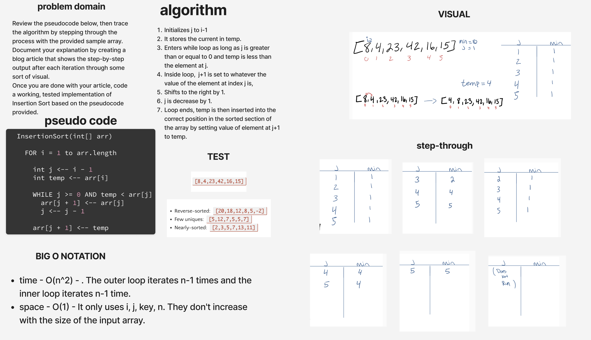

# Insertion Sort

[Insertion Sort Code Challenge](https://github.com/deshondixon/data-structures-and-algorithms/python/code_challenges/insertion_sort.py)

## Challenge
<!-- Description of the challenge -->

Review the pseudocode below, then trace the algorithm by stepping through the process with the provided sample array. Document your explanation by creating a blog article that shows the step-by-step output after each iteration through some sort of visual.

Once you are done with your article, code a working, tested implementation of Insertion Sort based on the pseudocode provided.

## Whiteboard Process
<!-- Embedded whiteboard image -->

## Approach & Efficiency
<!-- What approach did you take? Why? What is the Big O space/time for this approach? -->

Big O Notation:

- time - O(n^2) - . The outer loop iterates n-1 times and the inner loop iterates n-1 time.
- space - O(1) - It only uses i, j, key, n. They don't increase with the size of the input array.

## API
<!-- Description of each method publicly available to your Stack and Queue-->

- Provide a visual step through for each of the sample arrays based on the provided pseudocode
- Convert the pseudocode into working code in your language
- Present a complete set of working tests

## Tests

[Insertion Sort Unit Tests](https://github.com/deshondixon/data-structures-and-algorithms/python/tests/code_challenges/test_insertion_sort.py)

## Solution

    def insertion_sort(arr):
        n = len(arr)
        for i in range(1, n):
            key = arr[i]
            j = i-1
            while j >= 0 and key < arr[j]:
                arr[j + 1] = arr[j]
                j -= 1
            arr[j + 1] = key
        return arr

## References

- Visual example, pseduocode, step-through where used as they were provided from today's code challenge instructions.

